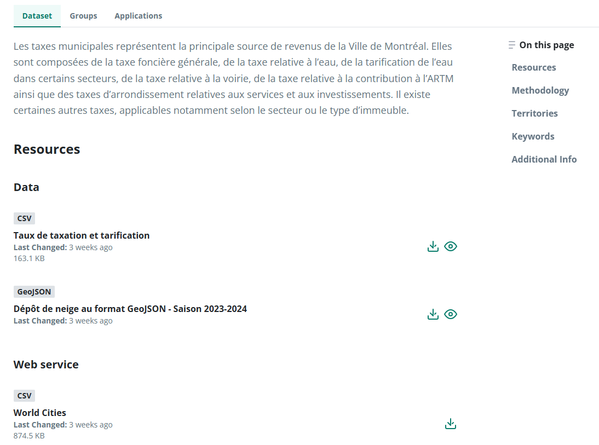
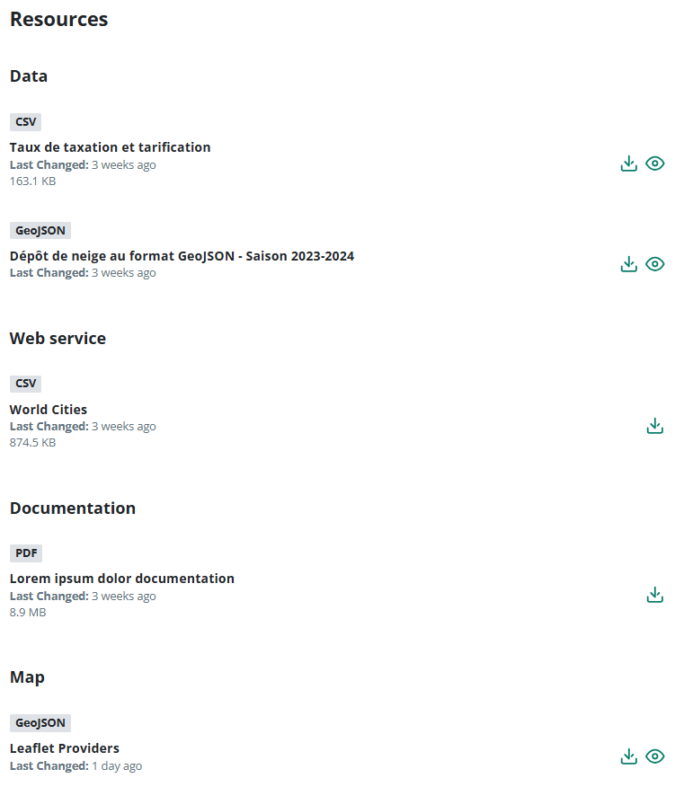

### Dataset Page

Na página de dataset foi aplicado as altereções de design de acordo com o Hochelaga Design System assim como fornecido no figma mockup.

Foi adicionado um tab que separa a visualização daquilo que são as informações, metadata e recursos do dataset na tab "Dataset", a listagem dos grupos a que pertece o dataset em "Groups" e na aba "Applications" encontra-se a listagem das aplicações em que se encontra o referido dataset.

#### Dataset Tab

No dataset tab encontra-se  a descrição do dataset seguido dos recursos que compõem o dataset, informações da metodologia, territórios, keywords e informações adicionais. Note que ao logo dessa tab poderá encontrar um menu de navegação (que foi movido para a direita nesta versão) que permite a fácil navegação dos conteúdos relacionados ao dataset.

##### Resources

Nesta versão os recursos foram agrupados por "Tipo de recurso" (Data, Webservice, Map or Documentation/Guide) e listados por formato de recurso mantendo as opções de fazer download diretamente ou ir para a página de  [previsualização do recurso](../resource-page/README.md)  (caso se aplique).

All of the others sections of the page remained pretty much the same, adjusting the UI as per figma.

#### Groups Tab

This tab lists all the groups that the dataset belongs to

#### Applications Tab

This tab lists all the applications that the dataset belongs to

