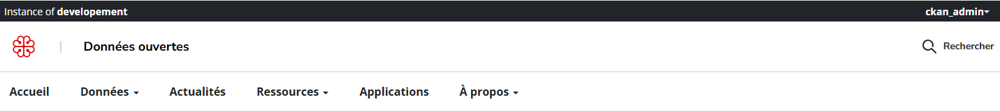
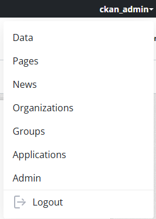
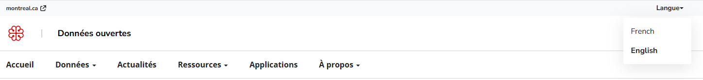
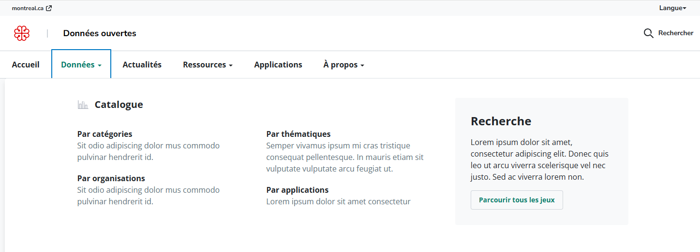
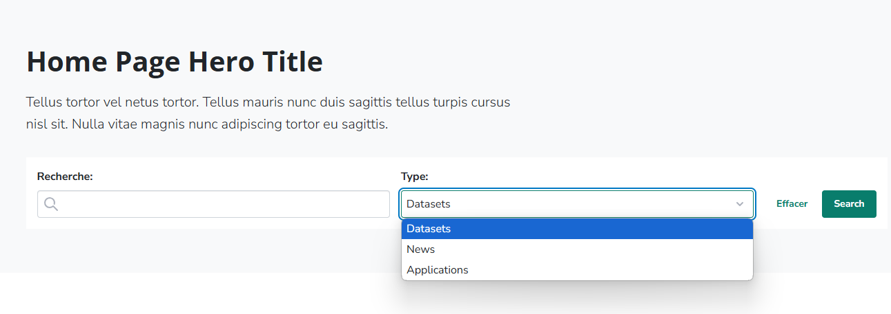

### Montreal Theme customization

As described in [A10](https://docs.google.com/document/d/12kdhDUbSpJEyY-320XrijPGNerQzHhNYwOTpy23tUpM/edit?tab=t.0#heading=h.ooltcei7gxab) the theme costumization should take in consideration the Hochelaga design system. To achieve that we: 

1. **Added Hochelaga Design System Assets**  
   Integrated the Hochelaga Design System's CSS and JS files into the CKAN base template. These assets are included in the `base.html` file using the following links:  
   ```html
   <link rel="stylesheet" type="text/css" href="/css/design-system.css">
   <link rel="stylesheet" type="text/css" href="/css/montreal.css">
   ```

2. **Scoped Design System with `.montreal-theme`**  
   Used SASS to create a `.montreal-theme` prefix class. This allows components from the design system to coexist with existing styles without conflicts.  

   By wrapping new components inside a parent element with the `.montreal-theme` class, styles are scoped, and the design system elements can be used seamlessly alongside old UI styles.

3. **Using Design System Components**  
   To implement a component, wrap it inside an element with the `.montreal-theme` class and add the desired design system markup. Here's an example:  
   ```html
   <div class="montreal-theme app-navbar position-relative">
     <nav class="wide-container position-static">
       <div class="font-open-sans text-base">
         <ul class="d-flex align-items-center flex gap-3 mb-0 pl-0">
           <li>
             <a href="/" class="pl-0 pt-2 pr-2 pb-2 block">{{ _('Accueil') }}</a>
           </li>
           <li class="dropdown app-mega-menu">
             <a href="/dataset" class="dropdown-toggle p-2 block" data-toggle="dropdown" role="button" aria-expanded="false">
               {{ _('Données') }} <span class="caret"></span>
             </a>
             <div class="dropdown-menu mt-0">
               <!-- Additional Design System Content -->
             </div>
           </li>
         </ul>
       </div>
     </nav>
   </div>
   ```

4. **Example Reference**  
   The full design system documentation is available [here](https://zeroheight.com/575tugn0n/n/25c219). Use it to find components and styles that fit your needs.  


### Navigation: Header

#### Top Header Behavior

The top header changes dynamically based on the user's authentication state:

- **Authenticated Users**  
  When a user is signed in, the top header appears as a dark panel.  
  - On the left side: Displays a reference to the CKAN instance.  
  - On the right side: Includes a user dropdown menu providing options to navigate to CKAN admin pages.



User dropdown menu:


- **Not Authenticated Users**  
  For users who are not signed in, the top header is light-gray.  
  - On the left side: Displays a link to the [montreal.ca](https://montreal.ca) website.  
  - On the right side: Provides an option to change the portal's language.




#### Main Menu Dropdown

Implemented the dropdown menu for the main navigation as per the A10 requirements and the mockups. The design uses Bootstrap's [Dropdown](https://getbootstrap.com/docs/3.3/components/#dropdowns) component for functionality.

- **Code Reference:**  
  [View the code](https://github.com/datopian/ckanext-montreal-theme/blob/montreal-dev-ui-2024/ckanext/montreal_theme/templates/navigation/main-menu.html)  

- **Preview:**  
  

---

#### Hero Section with Search Bar

Developed a hero section featuring a search bar to enhance user navigation and make it easier to find content. This section supports searches for three main content types available on the portal:

- **Datasets**  
- **Applications/Showcases**  
- **News**

A dropdown field in the search bar allows users to select the content type they wish to search for. Upon selecting an option and submitting, they are redirected to the search results page for that specific type.

- **Preview:**  
  


