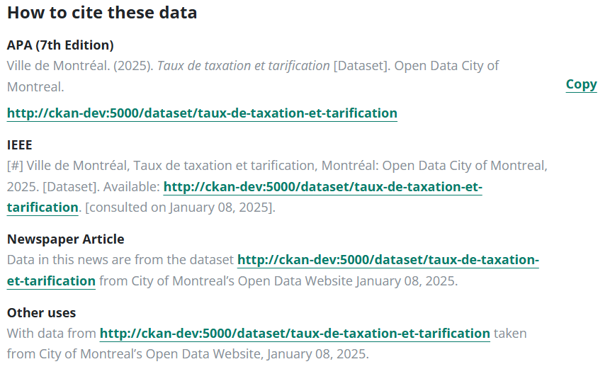

### Resource Page

The general UI of the resource page has been updated, applying UI components from the Hochelaga Design System to match the visuals and experience as provided in Figma.

#### Page Header

The page header was rearranged by moving the actions to the right and placing the description below the title. Additionally, a "go back" button was added to redirect to the dataset that the resource belongs to.

#### Explore Data

This section has been updated to use the design system definitions for the tabs and has been resized to occupy the full width of the page container. The functionality remains unchanged, preserving the same behavior as the previous version.

#### Data Dictionary

For applicable resources, the Data Dictionary section was updated to reflect the design provided, changing how the information is presented.

#### Citation

A dynamic citation section has been added to the resource page, with different formats available:
- APA (7th Edition)
- IEEE
- Newspaper Article
- Other uses

These fields are dynamic and use the resource metadata to generate the contents. On mouseover, the desired citation format can be copied to the clipboard, giving the user the option to paste and reference it anywhere.