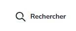
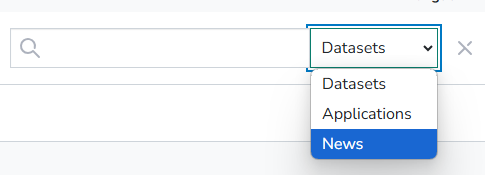

### Searchbar functionality

Improved the search module to help users find three types of content:  
   - **Datasets**  
   - **Applications and Data Reuse**  
   - **News**

2. **Key Modifications**  
   - Added a search bar in the header, available on all pages.  
     - Clicking the search bar opens a form for keyword input and content type selection (Datasets, Applications, or News).  
   - Redesigned the homepage to better showcase the search functionality.

   Default state:
   

   Clicked:
   

3. **How It Works**  
   - Users enter keywords in the search field.  
   - Select the content type they want to search for.  
   - Redirects:  
     - **Datasets:** `/dataset/?q=<search-term>`  
     - **Applications:** `/showcase?q=<search-term>`  
     - **News:** External site `/blog?q=<search-term>`  

4. **Notes**  
   - Reference mockups and images are in **ANNEXE1**.  
